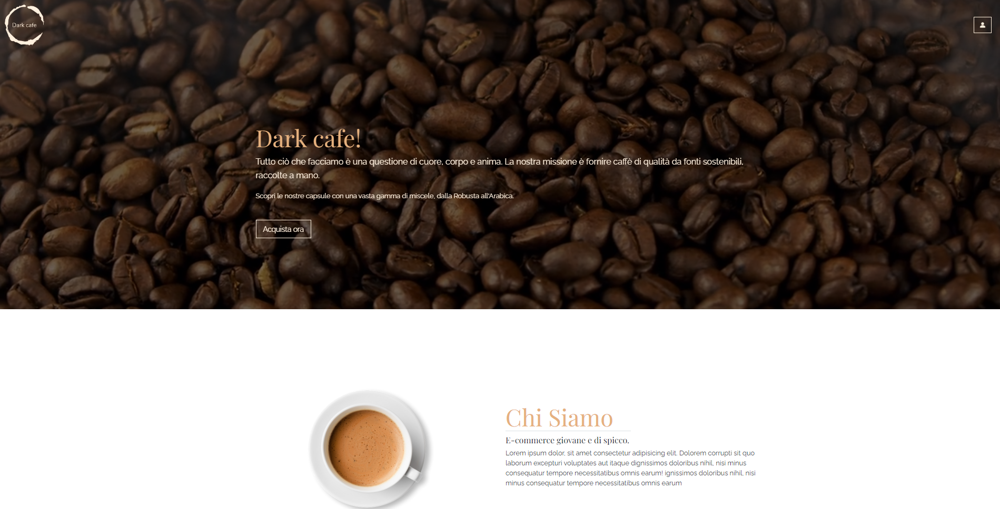

<h1>ECOMMERCE DARK CAFE</h1>

<h2>SETUP</h2>

To run this site correctly we need to use JSON-SERVER to query a local database that contains all the products.

 
<ol>
    <li>First of all, we need to install JSON-SERVER. Open a new terminal and type: <b>npm i json-server</b></li>
    <li>Once the installation is finished, we need to put the local server online. In the same terminal type: <b>json-server --watch assets/data/e-commerce.json</b></li>
    <li>Once the installation is finished, we need to put the local server online. In the same terminal type: <b>json-server --watch assets/data/e-commerce.json</b></li>
    <li>Congratulations we're done, the server is now online. We just have to send the site live to be able to view the project.</li>
</ol>